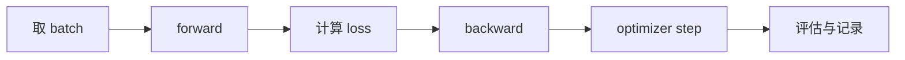

# 【类型】标题

> 一句话说明这篇笔记解决哪个 AI 概念、源码或实验问题。

## 学习目标

- 目标 1
- 目标 2
- 目标 3

## 前置知识

| 前置项 | 需要掌握到什么程度 |
|--------|--------------------|
| Python | 能读写基础类、函数、列表推导、张量代码 |
| 微积分 | 理解导数、链式法则、梯度方向 |
| 线性代数 | 理解向量、矩阵乘法、维度变化 |

## 核心问题

- 这个概念要解决什么问题？
- 输入和输出分别是什么？
- 训练信号从哪里来？
- 代码里最容易误解的变量是什么？

## 最小实现

```python
# 放置最小可运行代码，优先控制在 50 行以内。
```

## 张量形状

| 变量 | 形状 | 含义 |
|------|------|------|
| `x` | `[B, T]` | batch 内的 token id 序列 |
| `logits` | `[B, T, V]` | 每个位置对词表的预测分数 |
| `loss` | `[]` | 标量损失 |

## 训练循环



## 易错点

| 问题 | 典型原因 | 排查方式 |
|------|----------|----------|
| loss 不下降 | 学习率、梯度、数据或标签错误 | 打印 loss、梯度范数、样本预测 |
| shape 对不上 | batch/time/channel 维度混淆 | 在关键层打印 shape |
| 生成质量差 | 模型太小、训练不足、采样参数不合适 | 对比训练集 loss 和验证集 loss |

## 复现记录

| 项目 | 内容 |
|------|------|
| 数据集 |  |
| 代码入口 |  |
| 运行命令 |  |
| 关键超参 |  |
| 结果 |  |

## 相关文档

- [[../10_Karpathy路线/【教程】Karpathy式AI学习路径]]
- [[../20_LLM基础/【教程】LLM从字符模型到GPT]]

