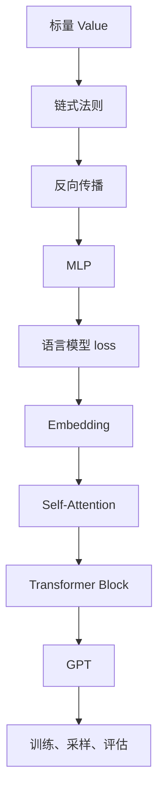

# Karpathy式AI学习路径

> 这条路线的目标不是快速记住 AI 名词，而是从最小可运行程序出发，把反向传播、语言模型和 GPT 训练过程一层层搭起来。

## 路线总览

| 阶段 | 主题 | 推荐资料 | 产出 |
|------|------|----------|------|
| 1 | 自动微分 | [micrograd](https://github.com/karpathy/micrograd) | 手写标量 `Value`、计算图、`backward()` |
| 2 | 神经网络基础 | [Neural Networks: Zero to Hero](https://karpathy.ai/zero-to-hero.html) | MLP、训练循环、梯度下降笔记 |
| 3 | 字符级语言模型 | [nn-zero-to-hero](https://github.com/karpathy/nn-zero-to-hero) | Bigram、MLP、BatchNorm、WaveNet 风格模型 |
| 4 | Transformer | Zero to Hero GPT 章节 | Self-Attention、Multi-Head Attention、残差、LayerNorm |
| 5 | 小型 GPT | [nanoGPT](https://github.com/karpathy/nanoGPT) | 训练 Tiny Shakespeare 或自定义文本模型 |
| 6 | LLM 应用雏形 | [LLM101n](https://github.com/karpathy/LLM101n) | 从 tokenizer 到 storyteller 的完整项目地图 |

## 学习节奏

### 第一轮：跑通

- 目标：每个项目都能运行，能看到 loss 下降或生成文本。
- 不强求完全理解每一行，只标记卡点。
- 每个阶段只写一篇“我跑通了什么”的实验记录。

### 第二轮：拆开

- 目标：能解释核心模块的输入、输出和 shape。
- 对每个模块画数据流图。
- 把“能跑”改成“能改”，例如修改隐藏层大小、上下文长度、学习率。

### 第三轮：复现

- 目标：关掉原项目，按自己的理解重写最小版本。
- 每次只保留一个核心概念：自动微分、Bigram、Attention、Transformer Block。
- 复现完成后对照原实现，记录差异。

## 关键地图

## 每阶段检查清单

- [ ] 能说清楚输入和输出。
- [ ] 能写出关键张量 shape。
- [ ] 能解释 loss 是怎么计算的。
- [ ] 能指出参数在哪里被更新。
- [ ] 能做一个小改动并预测影响。
- [ ] 能记录一个失败案例。

## 推荐笔记拆分

| 笔记 | 内容 |
|------|------|
| `【教程】micrograd自动微分` | `Value`、计算图、拓扑排序、反向传播 |
| `【教程】makemore字符模型` | 字符编码、Bigram、MLP、训练循环 |
| `【设计原理】Self-Attention本质` | Q/K/V、mask、注意力权重 |
| `【源码精读】nanoGPT训练入口` | `train.py`、config、模型、优化器 |
| `【实战案例】训练个人文本GPT` | 数据准备、训练命令、评估、生成样例 |

## 相关文档

- [[【最佳实践】从零复现神经网络]]
- [[../20_LLM基础/【教程】LLM从字符模型到GPT]]

