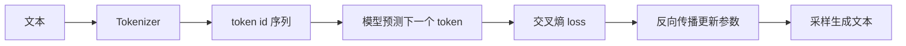

# LLM从字符模型到GPT

> LLM 的最小学习路径可以从一个问题开始：给定前面的 token，模型如何预测下一个 token？

## 核心闭环

## 概念阶梯

| 阶段 | 模型 | 学到什么 |
|------|------|----------|
| 1 | Bigram | 下一个 token 预测、交叉熵、采样 |
| 2 | MLP Language Model | Embedding、上下文窗口、隐藏层 |
| 3 | Self-Attention | token 之间动态读取信息 |
| 4 | Transformer Block | Attention、MLP、残差、LayerNorm |
| 5 | GPT | 多层 Transformer、自回归生成、训练/验证拆分 |

## Bigram 模型

Bigram 是最小语言模型：只根据当前 token 预测下一个 token。它的价值不是效果好，而是把语言模型训练闭环压到最小。

| 元素 | 含义 |
|------|------|
| 输入 | 当前 token id |
| 输出 | 下一个 token 的 logits |
| 参数 | `vocab_size x vocab_size` 的查表矩阵 |
| loss | next-token cross entropy |
| 生成 | 从预测分布里采样下一个 token |

## Self-Attention

Self-Attention 解决的是“当前位置应该读取前文哪些 token”的问题。

| 符号 | 直觉 |
|------|------|
| Q | 当前 token 想找什么信息 |
| K | 每个 token 能被匹配的特征 |
| V | 每个 token 真正提供的内容 |
| mask | 防止模型偷看未来 |

## GPT 训练入口

训练 GPT 时，最重要的是看懂这几个边界：

- 数据边界：训练集和验证集是否分开。
- 上下文边界：`block_size` 决定每次能看多长的历史。
- 模型边界：Embedding、Transformer Blocks、LM Head。
- 优化边界：学习率、batch size、迭代步数、权重衰减。
- 生成边界：temperature、top-k、max new tokens。

## 最小实验顺序

1. 用 100 行以内代码训练 Bigram。
2. 加入 token embedding 和 position embedding。
3. 加入单头 Self-Attention。
4. 扩展为多头 Attention。
5. 加入残差、LayerNorm、FeedForward。
6. 堆叠多个 Block，得到小型 GPT。
7. 对照 [nanoGPT](https://github.com/karpathy/nanoGPT) 理解工程化训练脚本。

## 常见误区

| 误区 | 更稳的理解 |
|------|------------|
| LLM 首先是聊天机器人 | LLM 首先是 next-token predictor |
| Attention 是记忆 | Attention 是基于当前输入动态计算的信息路由 |
| 参数越多越适合学习 | 小模型更适合检查概念和训练闭环 |
| 会调用 API 就懂 LLM | API 使用和模型训练原理是两层知识 |

## 相关文档

- [[../10_Karpathy路线/【教程】Karpathy式AI学习路径]]
- [[../10_Karpathy路线/【最佳实践】从零复现神经网络]]

