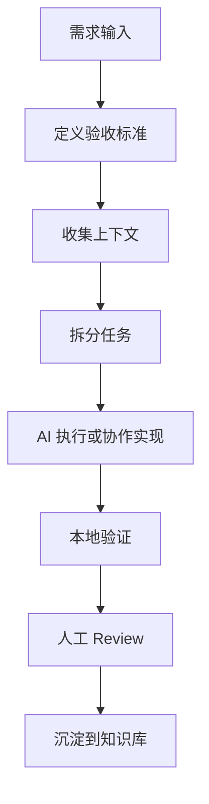

# AI辅助开发工作流

> 目标不是让 AI “直接写完”，而是把它纳入一个可控、可验证、可复盘的开发流程。

## 总流程



## 1. 需求输入

好的需求至少包含三件事：

| 内容 | 示例 |
|------|------|
| 目标 | 增加一个 Unity 资源检查器 |
| 范围 | 只检查 `Assets/UI` 下的 Prefab |
| 验收标准 | 输出违规列表，CI 失败码非 0 |

不要只写“帮我优化一下”。更好的写法是：

```text
请检查这个 Unity UI 模块的性能问题，重点关注 DrawCall、GC 分配和资源引用。
请先阅读相关代码，再给出问题列表和最小修改方案。
```

## 2. 上下文收集

AI 编码最容易失败的地方，不是模型能力，而是上下文不完整。推荐按下面顺序给上下文：

| 优先级 | 上下文 | 说明 |
|--------|--------|------|
| P0 | 目标和验收标准 | 明确任务完成条件 |
| P1 | 目录结构和关键文件 | 帮助 AI 找到边界 |
| P1 | 现有实现风格 | 避免生成不一致代码 |
| P2 | 历史问题和禁区 | 避免重复踩坑 |
| P2 | 相关文档链接 | 支持长期维护 |

## 3. 任务拆分

把任务拆成可以验证的小块：

- 读代码并总结现状
- 给出修改计划
- 修改最小范围文件
- 运行测试或静态检查
- 总结变更和风险

对于复杂任务，先让 AI 输出计划；对于明确任务，可以直接让 AI 执行。

## 4. 执行约束

给 AI 明确边界：

- 优先遵循现有项目风格
- 不引入新依赖，除非说明收益和成本
- 不重构无关模块
- 修改前先说明要改哪些文件
- 修改后必须运行可用的验证命令

## 5. 验证方式

| 类型 | 验证方式 |
|------|----------|
| 代码改动 | 单元测试、编译、lint、类型检查 |
| Unity 改动 | Editor 检查、PlayMode 测试、Profiler 数据 |
| 文档改动 | 链接检查、frontmatter 检查、目录索引检查 |
| 工作流改动 | 用一个真实任务演练 |

## 6. 复盘沉淀

任务结束后，把可复用内容写回知识库：

- 成功的 Prompt 写成 `【片段】` 或模板
- 稳定流程写成 `【笔记】` 或检查清单
- 出错经历写成 `【踩坑】`
- 阶段经验写成 `【复盘】`

## 常用 Prompt

```text
请先阅读相关文件并总结现状，不要立即修改。

请输出：
1. 当前实现的关键路径
2. 可能的风险点
3. 最小修改方案
4. 需要验证的命令
```

```text
请按现有代码风格完成这个改动。

约束：
- 不引入新依赖
- 不修改无关文件
- 修改后运行现有测试
- 最后说明变更、验证结果和剩余风险
```

## 相关文档

- [[【最佳实践】Prompt与上下文管理]]
- [[【系统架构】个人开发流水线]]
- [[【最佳实践】个人知识库维护机制]]
