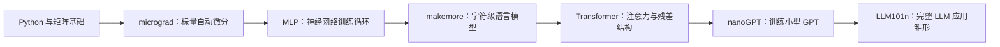

# AIKnowledge

> 面向 AI/LLM 原理、Karpathy 式从零构建、AI 辅助开发工作流和实验复现的长期知识库。原则是少建目录，多写可复用笔记；目录从真实使用中长出来。

## 目录结构

```text
AIKnowledge/
├── 00_元数据与模板/          # 元数据规范、最小模板、旧模板参考
├── 01_Inbox/                 # 每日捕获，先记下来，不急着分类
├── 10_Karpathy路线/          # Karpathy 式学习路线、复现方法、课程索引
├── 20_LLM基础/               # Tokenizer、Bigram、Transformer、GPT、Agent/RAG
├── 30_工作流/                # Prompt、AI 编码、工程自动化、知识库运营
├── 40_实验复现/              # 本地实验记录、训练日志、失败案例
└── 90_复盘案例/              # 学习复盘、任务复盘、项目案例
```

## 推荐入口

| 文档 | 定位 |
|------|------|
| [[00_元数据与模板/【模板】最小知识笔记]] | 新建正式笔记时优先使用的轻量模板 |
| [[10_Karpathy路线/【教程】Karpathy式AI学习路径]] | 从 micrograd 到 LLM101n 的学习路线 |
| [[10_Karpathy路线/【最佳实践】从零复现神经网络]] | 复现 Karpathy 教学项目时的操作方法 |
| [[20_LLM基础/【教程】LLM从字符模型到GPT]] | 从 Bigram 到 GPT 的最小知识路径 |
| [[30_工作流/【教程】AI辅助开发工作流]] | AI 辅助开发的需求、上下文、实现、验证流程 |
| [[30_工作流/【最佳实践】个人知识库维护机制]] | 每日捕获、每周整理、每月索引的维护节奏 |

## 学习路线



## 知识沉淀原则

- 每个概念都尽量绑定一个最小代码实验。
- 每篇源码笔记都回答：输入是什么、参数是什么、损失怎么来、梯度怎么回传、验证怎么看。
- 不急着追最新模型名词，先把训练循环、数据流和张量形状讲清楚。
- 重要结论要区分“数学定义”“工程实现”“个人理解”三层。
- AI 工作流内容也放在这里，靠目录和标签区分 `原理`、`工作流`、`实验`、`复盘`。

## 维护节奏

- 每日：只捕获到 `01_Inbox/`，不急着整理。
- 每周：最多整理 1-3 篇正式笔记。
- 每月：维护 README 和专题索引，清理过期链接。

## 文档类型

| 类型 | 用途 |
|------|------|
| `【笔记】` | 学习、理解、概念沉淀 |
| `【踩坑】` | 问题、原因、解决方案 |
| `【复盘】` | 项目、阶段、实验总结 |
| `【片段】` | Prompt、代码、命令、检查清单 |

## 外部资料

- [Karpathy: Neural Networks Zero to Hero](https://karpathy.ai/zero-to-hero.html)
- [karpathy/micrograd](https://github.com/karpathy/micrograd)
- [karpathy/nn-zero-to-hero](https://github.com/karpathy/nn-zero-to-hero)
- [karpathy/nanoGPT](https://github.com/karpathy/nanoGPT)
- [karpathy/LLM101n](https://github.com/karpathy/LLM101n)
