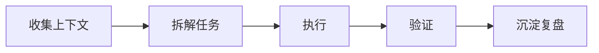

# 【类型】标题

> 一句话说明这个工作流解决什么问题。

## 适用场景

- 场景 1
- 场景 2
- 不适用场景

## 输入

| 输入 | 说明 |
|------|------|
| 需求/问题 | 要解决的问题描述 |
| 上下文 | 相关代码、文档、约束 |
| 验收标准 | 怎么判断任务完成 |

## 流程



## Prompt 模板

```text
你是我的 AI 编码助手。

目标：
- 

上下文：
- 

约束：
- 

请输出：
- 
```

## 检查清单

- [ ] 是否明确目标和验收标准
- [ ] 是否提供必要上下文
- [ ] 是否记录约束和禁区
- [ ] 是否有验证步骤
- [ ] 是否沉淀可复用经验

## 常见问题

| 问题 | 原因 | 处理方式 |
|------|------|----------|
| AI 输出偏题 | 上下文边界不清 | 先给目录、关键文件、验收标准 |
| 改动范围过大 | 任务拆分不足 | 只允许修改指定模块 |

## 相关文档

- [[../10_AI编码方法论/【教程】AI辅助开发工作流]]
- [[../10_AI编码方法论/【最佳实践】Prompt与上下文管理]]

