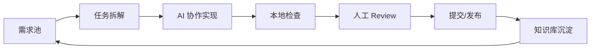

# 个人开发流水线

> 这套流水线的目标是把“写代码、检查、提交、复盘”变成稳定重复的个人生产系统。

## 总体架构

## 模块划分

| 模块 | 输入 | 输出 |
|------|------|------|
| 需求池 | 想法、Bug、优化点 | 可执行任务 |
| 任务拆解 | 需求说明、上下文 | 小步计划、验收标准 |
| AI 协作实现 | 代码、文档、约束 | 修改后的文件 |
| 本地检查 | 测试、lint、构建命令 | 可验证结果 |
| 人工 Review | diff、测试结果 | 修改意见或通过 |
| 知识库沉淀 | 问题、方案、复盘 | 可复用文档 |

## 推荐工具层

| 层级 | 工具类型 | 用途 |
|------|----------|------|
| 编辑层 | IDE、AI Agent | 阅读代码、修改文件、运行命令 |
| 检查层 | 测试、lint、规则检查器 | 发现回归、风格问题和性能风险 |
| 记录层 | Obsidian、Markdown | 沉淀笔记和决策 |
| 检索层 | 全文搜索、向量检索、RAG | 快速找回历史经验 |
| 自动化层 | Git hooks、CI、定时任务 | 固化重复检查 |

## 最小可行流水线

先不用追求复杂系统，个人场景推荐从 5 个动作开始：

1. 每个任务写一句验收标准
2. AI 修改前先读相关文件
3. 修改后必须运行一个验证命令
4. 提交前人工看 diff
5. 每周沉淀 1-3 篇知识库笔记

## Unity 项目扩展

Unity 项目可以额外加入：

- 资源命名检查
- Prefab 引用检查
- UGUI DrawCall 和 GC 检查
- Addressables 分组检查
- 平台构建预检查
- Profiler 数据复盘

这些内容可以继续沉淀到 [[../../UnityKnowledge/40_工具链/【教程】自动化规则检查工具]] 和 Unity 工具链目录。

## 相关文档

- [[../10_AI编码方法论/【教程】AI辅助开发工作流]]
- [[../30_知识库运营/【最佳实践】个人知识库维护机制]]

