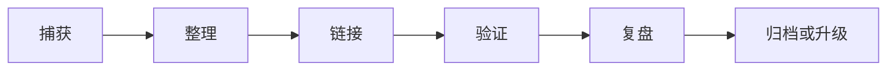

# 个人知识库维护机制

> 知识库的价值不在于文件多，而在于下一次遇到问题时能更快找到、判断和复用。

## 知识生命周期

## 捕获规则

以下内容值得进入知识库：

- 重复遇到的问题
- 花了超过 30 分钟才解决的问题
- 可以复用的 Prompt、命令、脚本、代码
- 影响架构方向的技术选择
- 性能测试结果和验证数据
- 项目复盘中的关键经验

以下内容可以先不写：

- 一次性聊天记录
- 没验证过的泛泛结论
- 没有上下文的链接收藏
- 只适用于当天的临时状态

## 每日流程

| 时间 | 动作 |
|------|------|
| 开始工作前 | 看任务目标和相关历史笔记 |
| 任务进行中 | 记录关键错误、命令、结论 |
| 任务结束后 | 把复用价值高的内容整理成文档 |

## 每周流程

- [ ] 整理本周临时笔记
- [ ] 给新增文档补齐 YAML frontmatter
- [ ] 添加 3 个以上内部链接
- [ ] 删除或归档无价值草稿
- [ ] 更新高频文档的 `updated` 字段
- [ ] 把成熟流程提炼成模板或检查清单

## 文档升级路径

| 当前状态 | 升级方向 |
|----------|----------|
| 临时笔记 | 整理为 `【踩坑记录】` |
| 多次复用的解决方案 | 升级为 `【最佳实践】` |
| 稳定命令或代码 | 升级为 `【代码片段】` |
| 多方案对比 | 升级为 `【架构决策】` |
| 项目完整经验 | 升级为 `【实战案例】` 或 `【案例复盘】` |

## Unity 与 AI 两套知识库的协同

| 内容 | 放置位置 |
|------|----------|
| Unity 架构、系统、性能、项目实现 | `UnityKnowledge` |
| AI 如何辅助 Unity 开发 | `AIWorkflowKnowledge` |
| Unity 自动化检查工具设计 | 两边都可链接，主体放 `UnityKnowledge/40_工具链` |
| Prompt、Agent 流程、知识库维护 | `AIWorkflowKnowledge` |

## 检索优化

写文档时刻意补足这些信息，后续 RAG 和全文搜索会更好用：

- 问题现象
- 使用场景
- 关键词别名
- 相关系统
- 失败原因
- 最终方案
- 验证方式

## 相关文档

- [[../../README]]
- [[../10_AI编码方法论/【教程】AI辅助开发工作流]]
- [[../20_工程自动化/【系统架构】个人开发流水线]]

