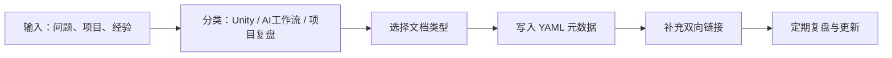

# 个人技术知识库

> 面向 Unity 技术架构、AI 编码工作流、项目复盘与个人经验沉淀的长期知识系统。

## 知识库组成

| 知识库 | 定位 | 适合沉淀的内容 |
|--------|------|----------------|
| [[UnityKnowledge/README]] | Unity 技术架构知识库 | Unity 架构设计、核心系统、性能优化、工具链、平台适配、项目实战 |
| [[AIWorkflowKnowledge/README]] | AI 编码/工作流知识库 | AI 辅助开发流程、Prompt 模板、上下文管理、自动化流水线、知识库运营 |

## 使用方式

### 1. 先分类，再写文档

新知识进入知识库前，先判断它解决的是哪类问题：

| 问题类型 | 推荐位置 |
|----------|----------|
| Unity 系统怎么设计 | `UnityKnowledge/10_架构设计` 或 `UnityKnowledge/20_核心系统` |
| Unity 性能怎么优化 | `UnityKnowledge/30_性能优化` |
| Unity 工具链怎么搭建 | `UnityKnowledge/40_工具链` |
| AI 怎么帮我写代码 | `AIWorkflowKnowledge/10_AI编码方法论` |
| 自动化流程怎么搭 | `AIWorkflowKnowledge/20_工程自动化` |
| 知识库怎么维护 | `AIWorkflowKnowledge/30_知识库运营` |

### 2. 用固定文档类型沉淀知识

优先沿用统一的文档类型：

| 类型 | 用途 |
|------|------|
| `【教程】` | 讲清楚怎么学、怎么用、怎么做 |
| `【最佳实践】` | 沉淀稳定有效的推荐做法 |
| `【踩坑记录】` | 记录问题现象、原因、解决方案 |
| `【架构决策】` | 对比方案并说明为什么选择某一种 |
| `【系统架构】` | 描述模块、流程、边界和协作关系 |
| `【代码片段】` | 保存可复用代码或命令模板 |

### 3. 用同一套工作流维护

## 每周维护清单

- [ ] 把本周解决过的问题沉淀为 `【踩坑记录】` 或 `【最佳实践】`
- [ ] 把重复使用 3 次以上的 Prompt、命令、代码整理为 `【代码片段】`
- [ ] 给新增文档补齐 YAML frontmatter、标签、内部链接
- [ ] 把零散笔记移动到对应知识库目录
- [ ] 检查是否有过期结论，更新 `updated` 字段

## 推荐入口

- [[UnityKnowledge/00_元数据与模板/学习路径导航]]
- [[UnityKnowledge/00_元数据与模板/文档定位指南]]
- [[AIWorkflowKnowledge/10_AI编码方法论/【教程】AI辅助开发工作流]]
- [[AIWorkflowKnowledge/30_知识库运营/【最佳实践】个人知识库维护机制]]

