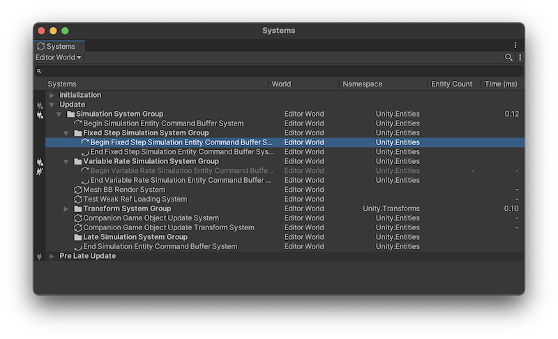

# System groups

### 系统组 (System Groups)

一个系统组可以包含其他系统和系统组作为其子元素。系统组在主线程上按排序顺序更新其子元素。

#### 创建自定义系统组

要创建自己的系统组，需创建一个继承自 `ComponentSystemGroup` 的类。使用 `UpdateInGroup` 属性指定成员系统需要在哪个组中进行更新。使用 `UpdateInGroup` 属性可确保 Unity 在创建所有系统时遵循 `CreateAfter` 和 `CreateBefore` 属性的约束。

#### 示例

```csharp
[UpdateInGroup(typeof(SimulationSystemGroup))]
public partial class MyCustomSystem : SystemBase
{
    protected override void OnUpdate()
    {
        // 你的系统更新逻辑
    }
}

public class MyCustomSystemGroup : ComponentSystemGroup { }
```

### 系统组的更新顺序

由于系统组中的所有更新列表是一起更新的，因此全局的系统更新顺序代表一种层次结构排列。其规则如下：

1. **OrderFirst 和 OrderLast**：直接子系统首先按照 `OrderFirst` 和 `OrderLast` 排列。
2. **UpdateBefore 和 UpdateAfter**：然后按照 `UpdateBefore` 和 `UpdateAfter` 约束进行排序。

由于子元素也可以是系统组，这些子系统组可能在返回到当前组的更新列表之前更新许多孙子系统。

<figure><figcaption></figcaption></figure>

#### 示例

假设有以下系统和系统组定义：

```csharp
[UpdateInGroup(typeof(SimulationSystemGroup))]
public partial class PeachSystem : SystemBase { }

[UpdateInGroup(typeof(SimulationSystemGroup))]
[UpdateBefore(typeof(PeachSystem))]
public partial class DaisySystem : SystemBase { }

[UpdateInGroup(typeof(SimulationSystemGroup))]
[OrderFirst]
public partial class MarioSystem : SystemBase { }

public class MyCustomSystemGroup : ComponentSystemGroup { }
```

### 系统窗口显示系统更新的层次顺序

在编辑器中，你可以使用系统窗口（`Window > Entities > Systems`）查看系统组的完整列表及其排序顺序。有关更多信息，请参阅Systems window documentation。

#### 默认系统组

默认世界包含一组 `ComponentSystemGroup` 实例的层次结构，可用于在帧的正确阶段更新系统。你可以将一个系统组嵌套在另一个系统组中，以确保所有组内的系统在正确的阶段更新，并根据组内的顺序进行更新。

#### Unity Player Loop 中的根级系统组

Unity 玩家循环中有三个根级系统组：

* **InitializationSystemGroup**：在玩家循环的初始化阶段结束时更新。
* **SimulationSystemGroup**：在玩家循环的更新阶段结束时更新。
* **PresentationSystemGroup**：在玩家循环的预后期更新阶段结束时更新。

#### 系统排序属性

你可以在系统上使用以下属性来确定其更新顺序：

| 属性                      | 描述                                                                                                                                                      |
| ----------------------- | ------------------------------------------------------------------------------------------------------------------------------------------------------- |
| **UpdateInGroup**       | 指定此系统应属于的 `ComponentSystemGroup`。如果未设置此属性，系统会自动添加到默认世界的 `SimulationSystemGroup`。你可以使用可选的 `OrderFirst` 和 `OrderLast` 参数对系统进行排序，使其排在组内其他不具有相同参数集的系统之前或之后。 |
| **UpdateBefore**        | 相对于同组中的其他系统对系统进行排序。当你将此属性应用于组时，会隐式约束其所有成员系统。                                                                                                            |
| **UpdateAfter**         | 同上，但是表示在某些系统之后进行更新。                                                                                                                                     |
| **CreateBefore**        | 相对于其他系统排序系统创建。在这里适用的排序规则与 `UpdateBefore` 和 `UpdateAfter` 相同，只是不涉及组，也不包括 `OrderFirst/OrderLast`。这些属性覆盖默认行为。系统销毁顺序定义为创建顺序的反向。                             |
| **CreateAfter**         | 同上，但表示在某些系统之后创建。                                                                                                                                        |
| **DisableAutoCreation** | 防止 Unity 在默认世界初始化期间创建系统。                                                                                                                                |
